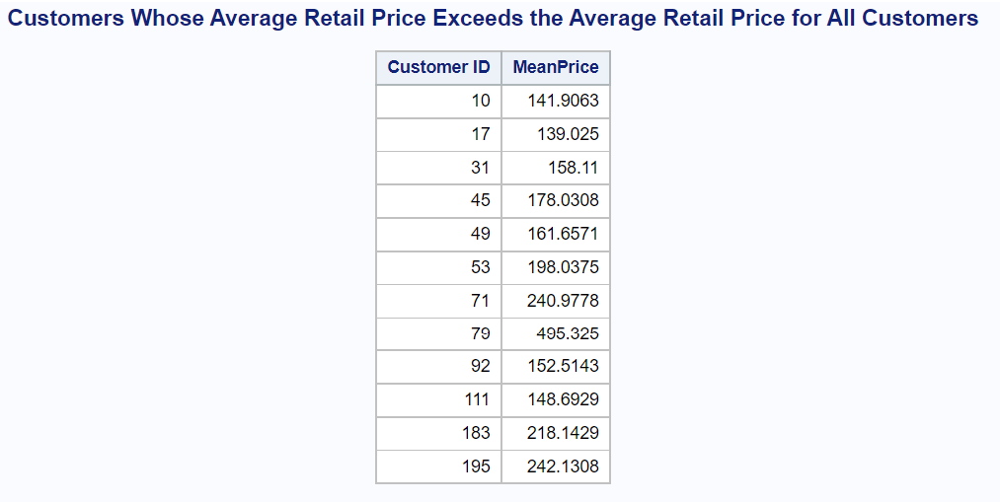
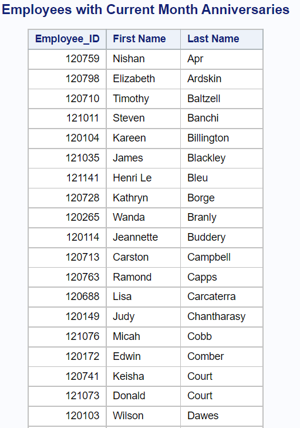
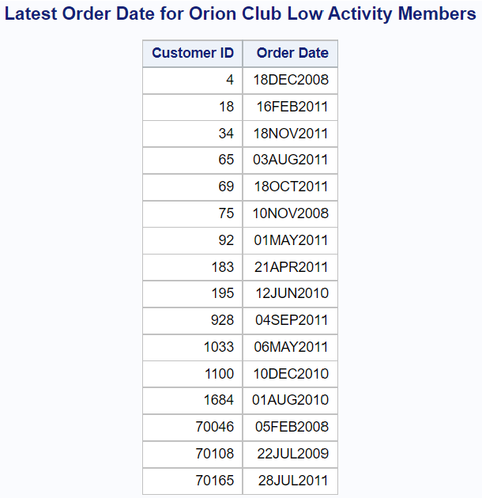
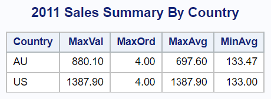
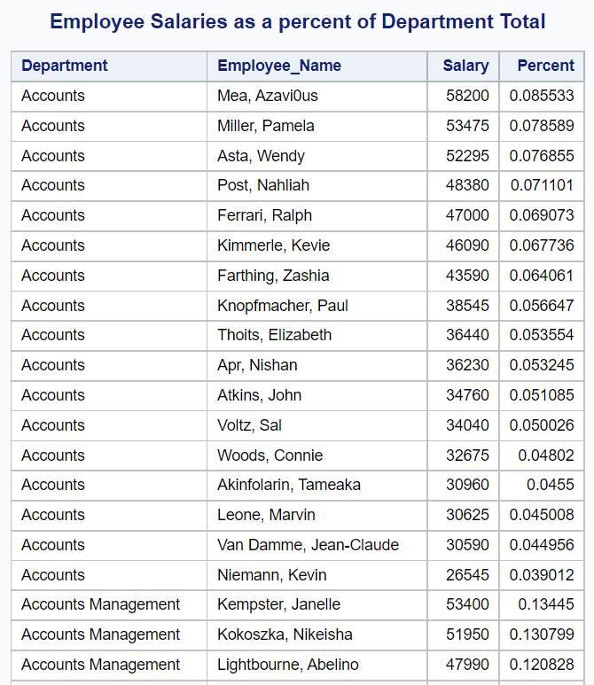
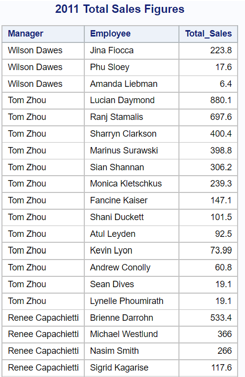

---
---

# M2L2Q1

## Code for Last Part

```SAS
proc sql;
	title "Customers Whose Average Retail Price Exceeds the Average Retail Price for All Customers";
	select Customer_ID, avg(Total_Retail_Price) as MeanPrice /*This is meansales in the output in the doc*/
	from ST522.order_fact
	where Order_Type=1
	group by Customer_ID
	having avg(Total_Retail_Price) > 
		(select avg(Total_Retail_Price)
		 from ST522.order_fact
		 where Order_Type=1
		 );
	
quit;
```

## Log for Last Part

```
1          OPTIONS NONOTES NOSTIMER NOSOURCE NOSYNTAXCHECK;
72         
73         proc sql;
74         title "Customers Whose Average Retail Price Exceeds the Average Retail Price for All
74       ! Customers";
75         select Customer_ID, avg(Total_Retail_Price) as MeanPrice /*This is meansales in the output
75       !  in the doc*/
76         from ST522.order_fact
77         where Order_Type=1
78         group by Customer_ID
79         having avg(Total_Retail_Price) >
80         (select avg(Total_Retail_Price)
81          from ST522.order_fact
82          where Order_Type=1
83          );
84         
85         quit;
NOTE: PROCEDURE SQL used (Total process time):
   real time           0.06 seconds
   cpu time            0.06 seconds
   

86         
87         OPTIONS NONOTES NOSTIMER NOSOURCE NOSYNTAXCHECK;
99         
```

## Output for Last Part



# M2L2Q2

## Code for Last Part

```SAS
/*Q2*/

%let my_date_formatted = %sysfunc(today(), MONTH.);
%PUT &my_date_formatted;

* B ;

proc sql;
	title "Employees with Current Month Anniversaries";
	select Employee_ID, 
		scan(Employee_Name, 2, ",") LENGTH=15 LABEL="First Name" as First, 
		scan(Employee_Name, 1, ",") LENGTH=15 LABEL="Last Name" as Last
	from ST522.employee_addresses
	where Employee_ID in 
		(select Employee_ID
		from ST522.employee_payroll 
		where MONTH(Employee_Hire_Date) = &my_date_formatted
		)
	order by Last;
quit;
```

## Log for Last Part

```
1          OPTIONS NONOTES NOSTIMER NOSOURCE NOSYNTAXCHECK;
72         
73         /*Q2*/
74         
75         %let my_date_formatted = %sysfunc(today(), MONTH.);
76         %PUT &my_date_formatted;

1

77         
78         * B ;
79         
80         proc sql;
81         title "Employees with Current Month Anniversaries";
82         select Employee_ID,
83         scan(Employee_Name, 2, ",") LENGTH=15 LABEL="First Name" as First,
84         scan(Employee_Name, 1, ",") LENGTH=15 LABEL="Last Name" as Last
85         from ST522.employee_addresses
86         where Employee_ID in
87         (select Employee_ID
88         from ST522.employee_payroll
89         where MONTH(Employee_Hire_Date) = &my_date_formatted
90         )
91         order by Last;
92         quit;
NOTE: PROCEDURE SQL used (Total process time):
   real time           0.14 seconds
   cpu time            0.14 seconds
   

93         
94         OPTIONS NONOTES NOSTIMER NOSOURCE NOSYNTAXCHECK;
106        
```

## Output for Last Part

These should differ from the pdf, because I actually did it based on the current day not February. Last I checked it was the same for Feb though.



# M2L2Q3

## Code for Last Part

```SAS
/*Q3*/

%let date = 02FEB2013;
%PUT &date;

proc sql;
	title "Level I or II Purchasing Agents Who are older than ALL Purchasing Agent IIIs ";
	select Employee_ID, 
		Job_Title LABEL="Employee Job Title ", 
		Birth_Date LABEL="Employee Birth Date",
		floor(yrdif(Birth_Date, '02FEB2013'd)) as Age
	from ST522.staff
	where Job_Title in ('Purchasing Agent I', 'Purchasing Agent II') 
		and yrdif(Birth_Date, '02FEB2013'd) > all(
			select yrdif(Birth_Date, '02FEB2013'd) as Age
			from ST522.staff
			where Job_Title = 'Purchasing Agent III'
			);
quit;
```

## Log for Last Part

```
1          OPTIONS NONOTES NOSTIMER NOSOURCE NOSYNTAXCHECK;
72         
73         /*Q3*/
74         
75         %let date = 02FEB2013;
76         %PUT &date;
02FEB2013
77         
78         proc sql;
79         title "Level I or II Purchasing Agents Who are older than ALL Purchasing Agent IIIs ";
80         select Employee_ID,
81         Job_Title LABEL="Employee Job Title ",
82         Birth_Date LABEL="Employee Birth Date",
83         floor(yrdif(Birth_Date, '02FEB2013'd)) as Age
84         from ST522.staff
85         where Job_Title in ('Purchasing Agent I', 'Purchasing Agent II')
86         and yrdif(Birth_Date, '02FEB2013'd) > all(
87         select yrdif(Birth_Date, '02FEB2013'd) as Age
88         from ST522.staff
89         where Job_Title = 'Purchasing Agent III'
90         );
91         quit;
NOTE: PROCEDURE SQL used (Total process time):
   real time           0.05 seconds
   cpu time            0.04 seconds
   

92         
93         OPTIONS NONOTES NOSTIMER NOSOURCE NOSYNTAXCHECK;
105        
```

## Output for Last Part

You may notice that the Age is 4 more on this one than the PDF because apparently the birthdate is also 4 years sooner, only took me 30 minutes to figure out why the result looked right but was off by 4 years from the PDF


# M2L2Q4

## Code for Last Part

```SAS
/*Q4*/

proc sql;
	title "Latest Order Date for Orion Club Low Activity Members";
	select Customer_ID,
		Last LABEL="Order Date" FORMAT=date9. as Order
	from
		/* This gets the last date per customer in the low activity subquery*/
		(
			select Customer_ID, 
				max(Order_Date) as Last
			from ST522.order_fact as of
			where of.Customer_ID in 
			/* This subquery just gets the unique customer id's that are low
			activity, also the column names are apparently different in the 
			different tables*/
				(
				select unique CustomerID
				from ST522.customer_type as ct,
					ST522.customer as c
				where ct.Customer_Type = 'Orion Club members low activity' and
					c.CustomerTypeID = ct.Customer_Type_ID
				)
			group by of.Customer_ID
			) as MaxDate
			/* This is the condition for if the last order date for the 
			virtual table is old enough*/
	where '01JAN2012'd > MaxDate.Last;
quit;
```

## Log for Last Part

```
1          OPTIONS NONOTES NOSTIMER NOSOURCE NOSYNTAXCHECK;
72         
73         /*Q4*/
74         
75         proc sql;
76         title "Latest Order Date for Orion Club Low Activity Members";
77         select Customer_ID,
78         Last LABEL="Order Date" FORMAT=date9. as Order
79         from
80         /* This gets the last date per customer in the low activity subquery*/
81         (
82         select Customer_ID,
83         max(Order_Date) as Last
84         from ST522.order_fact as of
85         where of.Customer_ID in
86         /* This subquery just gets the unique customer id's that are low
87         activity, also the column names are apparently different in the
88         different tables*/
89         (
90         select unique CustomerID
91         from ST522.customer_type as ct,
92         ST522.customer as c
93         where ct.Customer_Type = 'Orion Club members low activity' and
94         c.CustomerTypeID = ct.Customer_Type_ID
95         )
96         group by of.Customer_ID
97         ) as MaxDate
98         /* This is the condition for if the last order date for the
99         virtual table is old enough*/
100        where '01JAN2012'd > MaxDate.Last;
101        quit;
NOTE: PROCEDURE SQL used (Total process time):
   real time           0.06 seconds
   cpu time            0.07 seconds
   

102        
103        OPTIONS NONOTES NOSTIMER NOSOURCE NOSYNTAXCHECK;
115       
```

## Output for Last Part



# M2L2Q5

## Code for Last Part

```SAS
*B;

proc sql;
	title "2011 Sales Summary By Country";
	select Country, 
		max(Value_Sold) FORMAT=7.2 as MaxVal, 
		max(Orders) FORMAT=4.2 as MaxOrd, 
		max(Avg_Order) FORMAT=7.2 as MaxAvg,
		min(Avg_Order) FORMAT=7.2 as MinAvg
	from (
		select Country, 
			First_Name, 
			Last_Name, 
			sum(Total_Retail_Price) FORMAT=7.2 as Value_Sold, 
			count(distinct Order_ID) as Orders, 
			(calculated Value_Sold/ calculated Orders) FORMAT=7.2 as Avg_Order
		from ST522.order_fact as of,
			ST522.sales as s
		where s.Employee_ID = of.Employee_ID and
			year(Order_Date) = 2011          
		group by Country, First_Name, Last_Name
	) as Combined
	where Value_Sold ge 200
	group by Country
	order by Country;
quit;
```

## Log for Last Part

```
101        
102        *B;
103        
104        proc sql;
105        title "2011 Sales Summary By Country";
106        select Country,
107        max(Value_Sold) FORMAT=7.2 as MaxVal,
108        max(Orders) FORMAT=4.2 as MaxOrd,
109        max(Avg_Order) FORMAT=7.2 as MaxAvg,
110        min(Avg_Order) FORMAT=7.2 as MinAvg
111        from (
112        select Country,
113        First_Name,
114        Last_Name,
115        sum(Total_Retail_Price) FORMAT=7.2 as Value_Sold,
116        count(distinct Order_ID) as Orders,
117        (calculated Value_Sold/ calculated Orders) FORMAT=7.2 as Avg_Order
118        from ST522.order_fact as of,
119        ST522.sales as s
120        where s.Employee_ID = of.Employee_ID and
121        year(Order_Date) = 2011
122        group by Country, First_Name, Last_Name
123        ) as Combined
124        where Value_Sold ge 200
125        group by Country
126        order by Country;
127        quit;
NOTE: PROCEDURE SQL used (Total process time):
   real time           0.04 seconds
   cpu time            0.04 seconds
   

128        
129        OPTIONS NONOTES NOSTIMER NOSOURCE NOSYNTAXCHECK;
141        
```

## Output for Last Part



# M2L2Q6

## Code for Last Part

```SAS
*C;

proc sql;
	title "Employee Salaries as a percent of Department Total";
	select C.Department,
		C.Employee_Name,
		ep.Salary,
		(ep.Salary / C.Dept_Salary_Total) as Percent
	from (
		select A.Department as Department,
			A.Dept_Salary_Total as Dept_Salary_Total,
			B.Employee_ID as Employee_ID,
			B.Employee_Name as Employee_Name
		from (
			select Department,
				sum(Salary) as Dept_Salary_Total
			from ST522.employee_payroll as ep,
				ST522.employee_organization as eo
			where ep.Employee_ID = eo.Employee_ID
			group by eo.Department
			) as A
		inner join (
			select ea.Employee_ID as Employee_ID,
				eo.Department as Department,
				ea.Employee_Name as Employee_Name
			from ST522.employee_addresses as ea
			inner join ST522.employee_organization as eo
			on ea.Employee_ID = eo.Employee_ID
			) as B
		on A.Department = B.Department
	) as C
	inner join ST522.employee_payroll as ep
	on ep.Employee_ID = C.Employee_ID
	order by Department, Percent desc;
quit;
```

## Log for Last Part

```
107        
108        *C;
109        
110        proc sql;
111        title "Employee Salaries as a percent of Department Total";
112        select C.Department,
113        C.Employee_Name,
114        ep.Salary,
115        (ep.Salary / C.Dept_Salary_Total) as Percent
116        from (
117        select A.Department as Department,
118        A.Dept_Salary_Total as Dept_Salary_Total,
119        B.Employee_ID as Employee_ID,
120        B.Employee_Name as Employee_Name
121        from (
122        select Department,
123        sum(Salary) as Dept_Salary_Total
124        from ST522.employee_payroll as ep,
125        ST522.employee_organization as eo
126        where ep.Employee_ID = eo.Employee_ID
127        group by eo.Department
128        ) as A
129        inner join (
130        select ea.Employee_ID as Employee_ID,
131        eo.Department as Department,
132        ea.Employee_Name as Employee_Name
133        from ST522.employee_addresses as ea
134        inner join ST522.employee_organization as eo
135        on ea.Employee_ID = eo.Employee_ID
136        ) as B
137        on A.Department = B.Department
138        ) as C
139        inner join ST522.employee_payroll as ep
140        on ep.Employee_ID = C.Employee_ID
141        order by Department, Percent desc;
142        quit;
NOTE: PROCEDURE SQL used (Total process time):
   real time           0.40 seconds
   cpu time            0.39 seconds
   

143        
144        OPTIONS NONOTES NOSTIMER NOSOURCE NOSYNTAXCHECK;
156        
```

## Output for Last Part



# M2L2Q7

## Code for Last Part

```SAS
/*Q7*/

proc sql;
	title "2011 Total Sales Figures";
	select cat(Manager_First, ' ', Manager_Last) as Manager,
		cat(Employee_First, ' ', Employee_Last) as Employee,
		Total_Sales
	from (
		select scan(Names.EName, 1, ', ') as Employee_Last,
			scan(Names.EName, 2, ', ') as Employee_First,
			scan(Names.MName, 1, ', ')as Manager_Last, 
			scan(Names.MName, 2, ', ') as Manager_First,
			Sales.Total_Sales as Total_Sales,
			Names.Country as Country
		from (select e.Employee_ID as Employee_ID,
				e.Employee_Name as EName,
				e.Country as Country,
				m.Employee_ID as Manager_ID,
				m.Employee_Name as MName
			from ST522.employee_organization as o,
				ST522.employee_addresses as m,
				ST522.employee_addresses as e
			where e.Employee_ID = o.Employee_ID and
				o.Manager_ID = m.Employee_ID
		) as Names,
		(
			select Employee_ID,
				sum(Total_Retail_Price) as Total_Sales
			from ST522.order_fact
			where year(Delivery_Date) = 2011
			group by Employee_ID
		) as Sales
		where Names.Employee_ID = Sales.Employee_ID 
	) as Combined

	order by Country, Manager_Last, Manager_First, Total_Sales desc;
quit;
```

## Log for Last Part

```
1          OPTIONS NONOTES NOSTIMER NOSOURCE NOSYNTAXCHECK;
72         
73         /*Q7*/
74         
75         proc sql;
76         title "2011 Total Sales Figures";
77         select cat(Manager_First, ' ', Manager_Last) as Manager,
78         cat(Employee_First, ' ', Employee_Last) as Employee,
79         Total_Sales
80         from (
81         select scan(Names.EName, 1, ', ') as Employee_Last,
82         scan(Names.EName, 2, ', ') as Employee_First,
83         scan(Names.MName, 1, ', ')as Manager_Last,
84         scan(Names.MName, 2, ', ') as Manager_First,
85         Sales.Total_Sales as Total_Sales,
86         Names.Country as Country
87         from (select e.Employee_ID as Employee_ID,
88         e.Employee_Name as EName,
89         e.Country as Country,
90         m.Employee_ID as Manager_ID,
91         m.Employee_Name as MName
92         from ST522.employee_organization as o,
93         ST522.employee_addresses as m,
94         ST522.employee_addresses as e
95         where e.Employee_ID = o.Employee_ID and
96         o.Manager_ID = m.Employee_ID
97         ) as Names,
98         (
99         select Employee_ID,
100        sum(Total_Retail_Price) as Total_Sales
101        from ST522.order_fact
102        where year(Delivery_Date) = 2011
103        group by Employee_ID
104        ) as Sales
105        where Names.Employee_ID = Sales.Employee_ID
106        ) as Combined
107        
108        order by Country, Manager_Last, Manager_First, Total_Sales desc;
NOTE: The query as specified involves ordering by an item that doesn't appear in its SELECT clause.
109        quit;
NOTE: PROCEDURE SQL used (Total process time):
   real time           0.11 seconds
   cpu time            0.12 seconds
   

110        
111        OPTIONS NONOTES NOSTIMER NOSOURCE NOSYNTAXCHECK;
123        
```

## Output for Last Part


