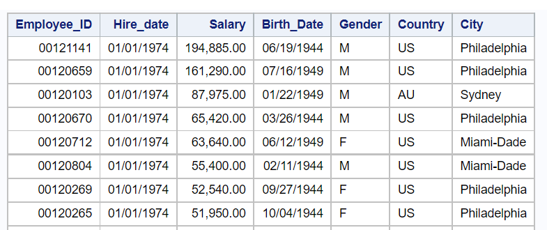
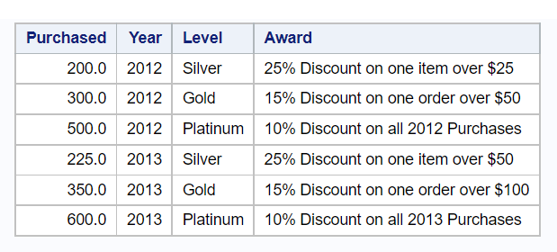
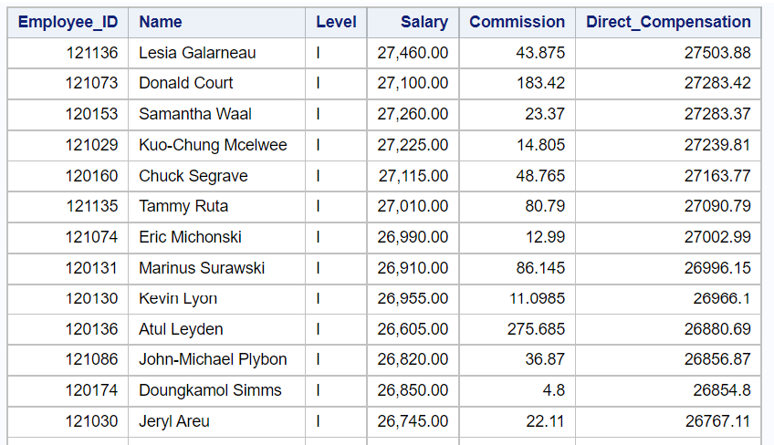
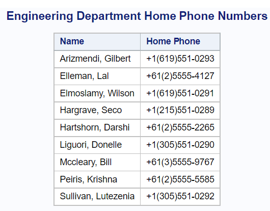
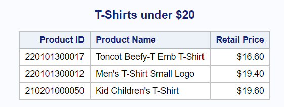
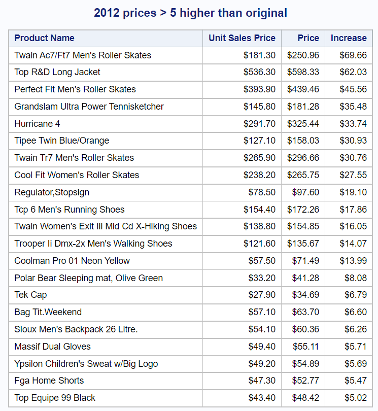

# M3L2Q1

## Code for Last Part

```SAS
proc sql;
	select *
	from ST522.employeesM3Q1
	order by year(Hire_date),salary desc;
quit;
```

## Log for Last Part

```
93         proc sql;
94         select *
95         from ST522.employeesM3Q1
96         order by year(Hire_date),Salary desc;
NOTE: The query as specified involves ordering by an item that doesn't appear in its SELECT clause.
97         quit;
```

## Output for Last Part



# M3L2Q2

## Code for Last Part

```SAS
proc sql;
	insert into ST522.rewardsM3Q2
		values (200.00, 2012, 'Silver', "25% Discount on one item over $25")
		values (300.00, 2012, 'Gold', "15% Discount on one order over $50")
		values (500.00, 2012, 'Platinum', "10% Discount on all 2012 Purchases")
		values (225.00, 2013, 'Silver', "25% Discount on one item over $50")
		values (350.00, 2013, 'Gold', "15% Discount on one order over $100")
		values (600.00, 2013, 'Platinum', "10% Discount on all 2013 Purchases");
quit;

proc sql;
	select *
	from ST522.rewardsM3Q2;
quit;
```

## Log for Last Part

```
87         proc sql;
88         insert into ST522.rewardsM3Q2
89         values (200.00, 2012, 'Silver', "25% Discount on one item over $25")
90         values (300.00, 2012, 'Gold', "15% Discount on one order over $50")
91         values (500.00, 2012, 'Platinum', "10% Discount on all 2012 Purchases")
92         values (225.00, 2013, 'Silver', "25% Discount on one item over $50")
93         values (350.00, 2013, 'Gold', "15% Discount on one order over $100")
94         values (600.00, 2013, 'Platinum', "10% Discount on all 2013 Purchases");
NOTE: 6 rows were inserted into ST522.REWARDSM3Q2.

95         quit;
NOTE: PROCEDURE SQL used (Total process time):
       real time           0.00 seconds
       cpu time            0.01 seconds
       

96         
97         proc sql;
98         select *
99         from ST522.rewardsM3Q2;
100        quit;
NOTE: PROCEDURE SQL used (Total process time):
       real time           0.04 seconds
       cpu time            0.04 seconds
```

## Output for Last Part



# M3L2Q3

## Code for Last Part

```SAS
proc sql;
create table direct_compensation as
	select  s.Employee_ID as Employee_ID format=8.,
        cat(s.First_Name, ' ', s.Last_Name) as Name length=30 format=$30.,
        scan(s.Job_Title, 3, ' ') as Level format=$3.,
        s.Salary as Salary format=COMMA12.2,
        Comm.Commission as Commission,
        Comm.Commission + s.Salary as Direct_Compensation
	from ST522.sales as s,
		(
		select Employee_ID,
			sum(of.Total_Retail_price)*0.15 as Commission
		from ST522.order_fact as of
		group by Employee_ID
		) as Comm
	where Comm.Employee_ID=s.Employee_ID 
	order by Level, Direct_Compensation desc;
quit;

proc sql;
	select *
	from direct_compensation;
quit;
```

## Log for Last Part

```
74         proc sql;
75         create table direct_compensation as
76         select  s.Employee_ID as Employee_ID format=8.,
77                 cat(s.First_Name, ' ', s.Last_Name) as Name length=30 format=$30.,
78                 scan(s.Job_Title, 3, ' ') as Level format=$3.,
79                 s.Salary as Salary format=COMMA12.2,
80                 Comm.Commission as Commission,
81                 Comm.Commission + s.Salary as Direct_Compensation
82         from ST522.sales as s,
83         (
84         select Employee_ID,
85         sum(of.Total_Retail_price)*0.15 as Commission
86         from ST522.order_fact as of
87         group by Employee_ID
88         ) as Comm
89         where Comm.Employee_ID=s.Employee_ID
90         order by Level, Direct_Compensation desc;
NOTE: Table WORK.DIRECT_COMPENSATION created, with 90 rows and 6 columns.

91         quit;
NOTE: PROCEDURE SQL used (Total process time):
   real time           0.02 seconds
   cpu time            0.01 seconds
   

92         
93         proc sql;
94         select *
95         from direct_compensation;
96         quit;
```

## Output for Last Part



# M3L2Q4

## Code for Last Part

```SAS
proc sql;
	title "Engineering Department Home Phone Numbers";
	select Name,
		Phone_Number
	from ST522.phone_listM3Q4
	where Department = "Engineering"
	order by Name;
quit;
```

## Log for Last Part

```
91         proc sql;
92         title "Engineering Department Home Phone Numbers";
93         select Name,
94         Phone_Number
95         from ST522.phone_listM3Q4
96         where Department = "Engineering"
97         order by Name;
98         quit;
NOTE: PROCEDURE SQL used (Total process time):
   real time           0.07 seconds
   cpu time            0.09 seconds
```

## Output for Last Part



# M3L2Q5

## Code for Last Part

```SAS
proc sql;
	title "T-Shirts under $20";
	select Product_ID,
		Product_Name,
		Price
	from ST522.t_shirtsM3Q5
	where Price < 20
	order by Price;
quit;
```

## Log for Last Part

```
96         * C ;
97         
98         proc sql;
99         title "T-Shirts under $20";
100        select Product_ID,
101        Product_Name,
102        Price
103        from ST522.t_shirtsM3Q5
104        where Price < 20
105        order by Price;
106        quit;
NOTE: PROCEDURE SQL used (Total process time):
   real time           0.03 seconds
   cpu time            0.04 seconds
```

## Output for Last Part



# M3L2Q6

## Code for Last Part

```SAS
proc sql;
	title "2012 prices > 5 higher than original";
	select c.Product_Name as Product_Name,
		l.Unit_Sales_Price as Unit_Sales_Price,
		c.Price as Price,
		c.Price-l.Unit_Sales_Price as Increase format=DOLLAR7.2
	from ST522.current_catalogM3Q6 as c,
		ST522.price_list as l
	where c.Product_ID = l.Product_ID and
		c.Price-l.Unit_Sales_Price > 5 
	order by Increase desc;
quit;
```

## Log for Last Part

```
101        
102        proc sql;
103        title "2012 prices > 5 higher than original";
104        select c.Product_Name as Product_Name,
105        l.Unit_Sales_Price as Unit_Sales_Price,
106        c.Price as Price,
107        c.Price-l.Unit_Sales_Price as Increase format=DOLLAR7.2
108        from ST522.current_catalogM3Q6 as c,
109        ST522.price_list as l
110        where c.Product_ID = l.Product_ID and
111        c.Price-l.Unit_Sales_Price > 5
112        order by Increase desc;
WARNING: Column named Product_ID is duplicated in a select expression (or a view). Explicit references to it will be to the first one.
113        quit;
NOTE: PROCEDURE SQL used (Total process time):
   real time           0.05 seconds
   cpu time            0.03 seconds
   
```

## Output for Last Part


